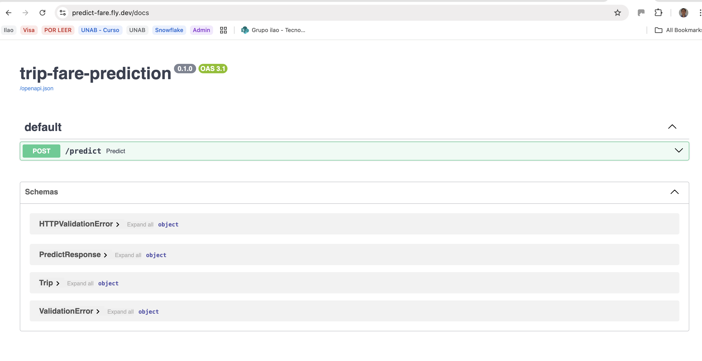
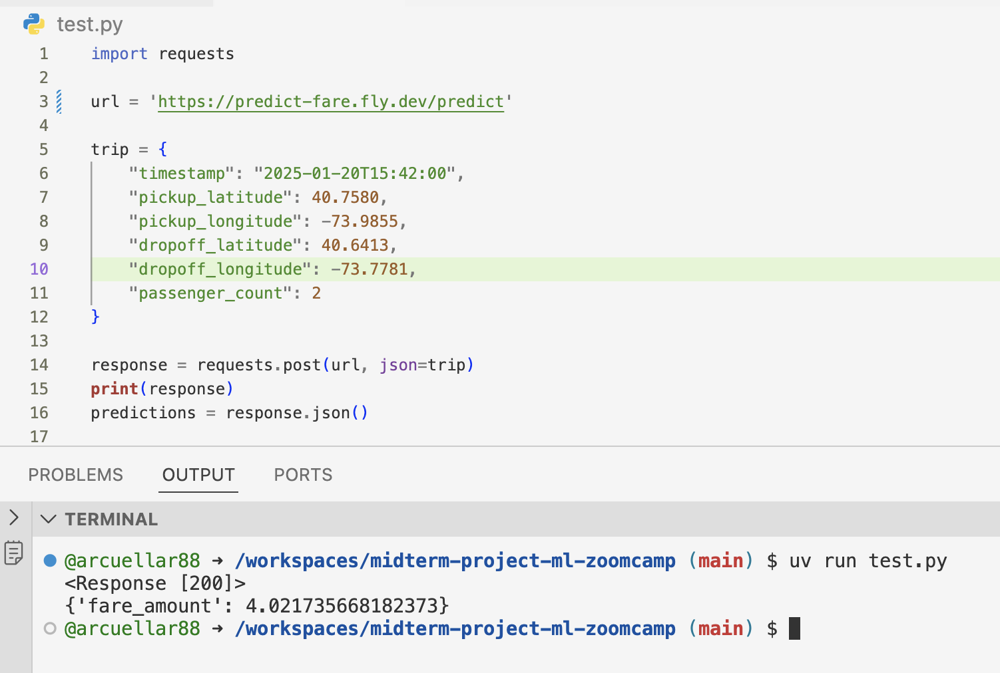

# 🚕 Uber Taxi Fare Prediction — Project Summary

This project builds a machine-learning model capable of predicting the fare amount of a New York City Uber trip based on trip characteristics available at the moment of pickup. The model is designed to be used in a real-time API for fare estimation, following a production-ready MLOps workflow.

## 🎯 Project Goal

Estimate the total Uber fare before the trip begins using features such as trip distance, pickup time, pickup/dropoff locations, and passenger count.

The model is intended for use with new unseen data, enabling applications like mobile apps, ride-hailing services, or pricing simulations.

## 📂 Dataset

The project uses the publicly available [NYC Yellow Taxi Trip Records dataset (2016)](https://www.kaggle.com/datasets/yasserh/uber-fares-dataset), which includes:

- Pickup timestamp. Date and time when the meter was engaged
- Latitude/longitude coordinates. The pickup and  dropoff locations
- Passenger count. The number of passengers in the vehicle (driver entered value)
- Fare amount. The cost of each trip in usd

After cleaning and filtering, the dataset contains ~1M high-quality rows.

## 🧹 Data Cleaning & Feature Engineering

The following transformations were applied:

### 1. Time-based features

- hour (0–23)
- month (1–12)
- day_of_week (0–6)
- is_rush_hour
- is_weekend

### 2. Geospatial features

- [Haversine](https://en.wikipedia.org/wiki/Haversine_formula) distance in kilometers
- [H3](https://www.uber.com/en-CO/blog/h3/) hexagonal spatial encoding (resolution 8)
- pickup_h3_int
- dropoff_h3_int


### 3. Target transformation

Log transformation: </br>
log_fare = log1p(fare_amount) </br>
(improves normality and model stability) </br>

### 4. Outlier filtering

- Removed impossible coordinates
- Removed zero or negative fares
- Removed extremely long trips (>100 km)

## 📊 Exploratory Data Analysis (EDA)

Key insights include:

- Fare grows almost linearly with distance
- Rush hours increase fares due to traffic
- Manhattan hexagons (H3) have the highest pickup density
- Target variable is right-skewed → improves after log1p

## 🤖 Models Evaluated

### 1. Dummy Regressor

- Baseline for comparison
- RMSE ≈ 0.50 (log-fare scale)

### 2. Linear Regression

- Surprisingly strong baseline
- RMSE ≈ 0.30

### 3. XGBoost Regressor

Tuned hyperparameters using manual grid search:

- max_depth
- min_child_weight
- learning_rate
- n_estimators
- subsample
- colsample_bytree

Final performance:

RMSE ≈ 0.253 (log-fare scale)

Significantly better than linear models.

## 🧪 Cross-Validation

- Used 5-fold cross-validation with shuffled splits for robust evaluation.

## 🚀 Deployment: FastAPI + Model Pipeline

A real-time prediction API was implemented with:

- FastAPI for serving HTTP requests
- Pydantic model (Trip) for input validation
- Full preprocessing inside a custom function:
- H3 encoding
- Haversine distance
- Time extraction
- Rush hour flag
- Returning a feature DataFrame
- Uvicorn for production-capable serving

API endpoint:
POST /predict

Response:
```json
{
  "fare_amount": 12.45
}
```

🧩 Why this Project Is Valuable

- It applies ML + geospatial analytics
- Clean EDA → Feature Engineering → Modeling → Deployment pipeline
- Uses H3 indexing, common in mobility and logistics
- Close to real ride-hailing products (Uber, Lyft, Cabify)
- Reproducible and deployable end-to-end

## 🚀 Instructions on how to run the project

This project provides a full pipeline for training a taxi fare prediction model and serving it through a FastAPI endpoint using uvicorn.
Below are the steps for installation, development, training, testing, and running the production API via Docker.

### 📦 1. Install Dependencies (uv)

This project uses uv to manage Python environments and dependencies.

There are two types of dependencies:

#### Runtime dependencies (default)

These are the minimum required to run the API in production (predict.py).
Install them with:

```sh
uv sync

```

#### Development dependencies (--dev)

Required for:

- training the model (train.py)
- running tests (test.py)
- working with notebooks
- using requests, pandas, numpy, scikit-learn, etc.

Install them with:

```sh
uv sync --dev
```

Use --dev whenever you are working locally or training models.

### 🏋️ 2. Train the Model

If you want to retrain the model:

```sh
uv sync --dev
uv run python train.py
```

This will produce a new model.bin that is later used by predict.py.

### ▶️ 3. Run the Prediction API Locally

Start the FastAPI server:

```sh
uv sync
uv run uvicorn predict:app --host 0.0.0.0 --port 9696
```

You can then send requests to:
http://localhost:9696/predict

### 🧪 4. Test the API Client

A small test.py script is included that calls the API using requests.
Since requests is a dev dependency, install dev deps first:

```sh
uv sync --dev
uv run python test.py
```

### 📘 5. Use the Interactive API Docs (Swagger UI)

FastAPI automatically provides an interactive API console.

Simply go to:

http://localhost:9696/docs


From here, you can:

browse the API

see input/output schemas

test predictions directly from your browser (no need for curl or external scripts). You can use the following input. 

```json
{
    "timestamp": "2025-01-20T15:42:00",
    "pickup_latitude": 40.7580,
    "pickup_longitude": -73.9855,
    "dropoff_latitude": 40.6413,
    "dropoff_longitude": -73.7781,
    "passenger_count": 2
}
```

**Response:**
```json
{
  "fare_amount": 54.79786682128906
}
```


### 🐳 6. Build & Run with Docker (Production)

The Docker image includes only runtime dependencies to keep it lightweight.

#### Build the image:

```sh
docker build -t predict-fare .
```

#### Run the container:

```sh
docker run -it --rm -p 9696:9696 predict-fare
```

The API will be available at:
http://localhost:9696/predict


## Deployment Fly.io

Install fly.io

```sh
curl -L https://fly.io/install.sh | sh
```

Autenticate and deploy

```sh
fly auth signup
fly launch --generate-name
fly deploy
```

Get the URL from the logs, it should be something along these lines:

Visit your newly deployed app at https://predict-fare.fly.dev/
Put the url into test.py and check that it works.

Now you can terminate the deployment

```sh
fly apps destroy <app-name>
``` 
### Sample images and video

app-name: predict-fare





<video src="https://github.com/user-attachments/assets/d987bdd4-7604-4d3f-9d8a-cbabcc43b3ec"></video>


## 📚 References

This project is part of the Machine Learning Zoomcamp course by Alexey Grigorev.  @DataTalksClub @alexeygrigorev

Machine Learning Zoomcamp — Course materials and guidance
https://datatalks.club/blog/machine-learning-zoomcamp.html

Author: Alexey Grigorev

Uber Fares Dataset — Primary dataset used for model development
https://www.kaggle.com/datasets/yasserh/uber-fares-dataset

Author: Yasser H.

💡 Built with help from ChatGPT.